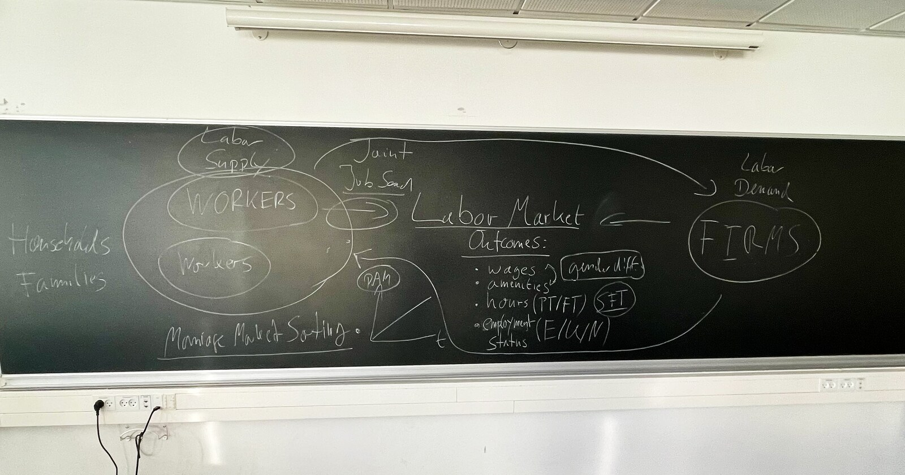

{fig-alt="Chalkboard with diagrams of labor market connecting workers and firms, with notes on outcomes (wages, amenities, hours, employment status)"}

## PhD students

Aarhus University:

- Simon Sloth — 2025–2029 (expected)
- [Fynn Lohre](https://www.fynn-lohre.com/) — 2024–2027 (expected)
- [Frederik Almar](https://sites.google.com/view/frederikalmar) — 2022–2025. First job: Aarhus University.
- [Simone Maria Bonin](https://sites.google.com/view/simone-maria-bonin/home-page) — 2018–2020. First job: The Danish National Bank.

## Courses

### Aarhus University

- [(Advanced) Micro and Macro Models of the Labor Market](https://kursuskatalog.au.dk/da/course/122545/5415-P-Micro-and-Macro-Models-of-the-Labor-Market) (graduate) — Lecturer and Course Coordinator, since Spring 2024
- [Labour Economics](https://kursuskatalog.au.dk/en/course/113440/4407-Labour-Economics) (graduate) — Lecturer and Course Coordinator, since Fall 2019
- [International Economics](https://kursuskatalog.au.dk/da/course/126495/5522-International-Economics) (graduate) — Lecturer, Fall 2024-2025
- Monetary Economics (graduate) — Lecturer, Spring 2018–2020
- Economics (undergraduate, macro part) — Lecturer, Fall 2018

### LMU Munich

- Public Economics II (3rd-year undergrad) — TA, Winter 2015/16
- Seminar on Labor Market Policy (3rd-year undergrad) — TA, Summer 2015
- Public Economics II (3rd-year undergrad) — TA, Summer 2015
- Public Economics I (2nd-year undergrad) — TA, Winter 2013/14
